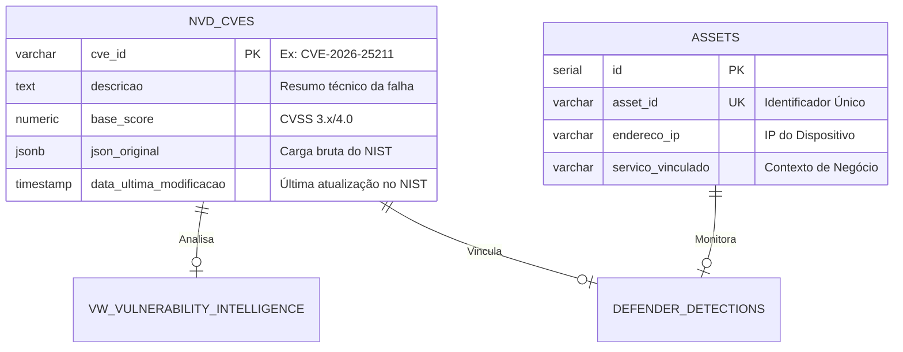

# 🛡️ NVD Vulnerability Intelligence System

Sistema automatizado de ingestão, enriquecimento e roteamento de vulnerabilidades (CVEs) baseado na API 2.0 do NIST. Este projeto centraliza a gestão de falhas de segurança para equipes de TI e Cibersegurança.

## 📊 Panorama do Projeto
O sistema gerencia uma base de **330.421 registros** (1999-2026), processando dados em formato JSONB para extrair inteligência acionável.

### 🏗️ Arquitetura do Banco de Dados
A estrutura opera no **PostgreSQL** dentro do schema `vulnerability`, utilizando o usuário `airflow_sec` para garantir total independência operacional.

### 🔄 Fluxo de Automação (Airflow)
O ecossistema é mantido por duas DAGs principais que garantem a integridade dos dados:

nvd_history_load: Responsável pelo backfill histórico (1999-2025). Processou o volume recorde de 42.043 registros em 2025.

nvd_daily_update: Coleta diária incremental. Utiliza a lógica de Upsert (ON CONFLICT) para manter o banco sincronizado com as modificações de 2026.

### 🧠 Inteligência de Roteamento (Views)
A camada de visão (vw_vulnerability_intelligence) atua como o motor de decisão do sistema:

 Detecção de Exploits: Identifica automaticamente referências para Exploit-DB, GitHub PoCs e Metasploit no corpo do JSON.
 Priorização de Risco: Classifica as CVEs entre 🚨 EMERGÊNCIA, 🔥 CRÍTICO e ⚠️ ALTO RISCO.
 Roteamento para Squads:
* SQUAD WORKPLACE: Windows 10/11, Chrome e Office.
* SQUAD INFRA/DBA: Windows Server, SQL Server e SharePoint.
* SQUAD CREATIVE APPS: Produtos Adobe.
* SQUAD NETWORK: Ativos Cisco, Fortinet e Palo Alto.
